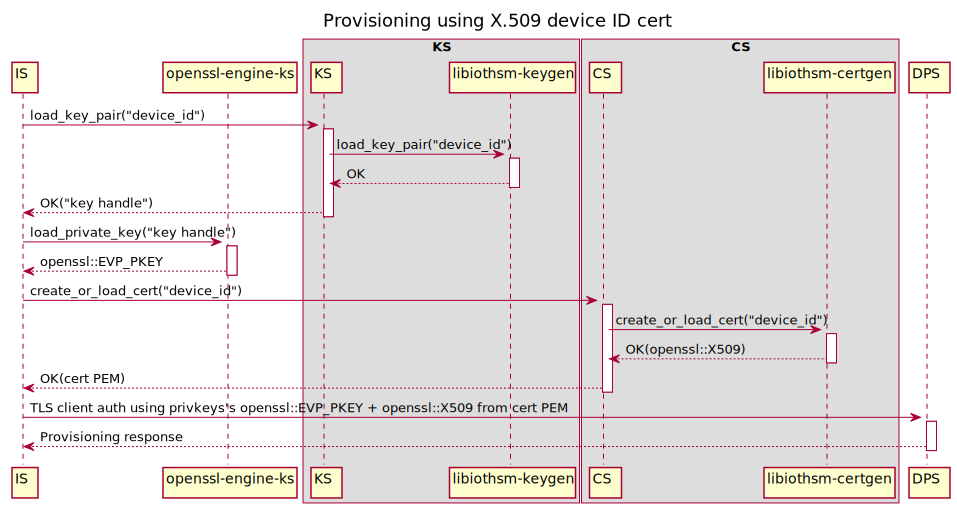
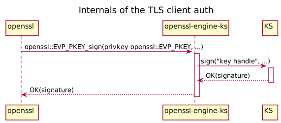
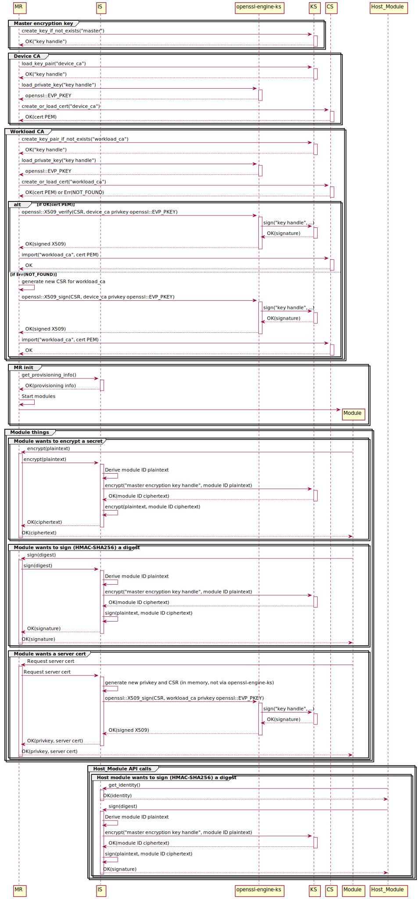

IoT Edge v2 is made up of several independent services instead of one monolithic `iotedged`

- Identity Service

    Handles provisioning.


- Keys Service

    Stores keys and allows callers to perform operations with those keys like encrypt, decrypt, sign.


- Certificates Service

    Stores certificates and allows callers to import and export them.


- Module Runtime

    Runs Edge modules, like `iotedged` today, though not necessarily specifically Docker containers.


Each component talks to the other components over RPC of some sort (TODO: HTTP-over-UDS? gRPC-over-UDS? D-Bus? Something else?)

# Provisioning

## X.509 device ID cert

1. User preloads the device ID cert's privkey into their device's HSM and installs the PKCS#11 library to access it.

1. User configures KS to use PKCS#11 and preloads the device ID cert's privkey.

    ```toml
    [keystore.pkcs11]
    "lib_path" = "/usr/lib/softhsm.so"
    "base_slot" = "pkcs11:slot-id=0?pin-value=1234"

    [keystore.preloaded_key]
    "device-id" = "pkcs11:slot-id=0;object=device%20id?pin-value=1234"
    ```

2. User configures CS to preload the device ID cert.

    ```toml
    [certstore]
    "homedir_path" = "/var/lib/iotedge/cs"

    [certstore.preloaded_cert]
    "device-id" = "/var/secrets/device-id.cer"
    ```

3. User configures IS with provisioning info.

    ```toml
    # TODO: If we decide certs and keys *must* come from KS and CS, then the URI is redundant and it could directly be the respective IDs.
    # Otherwise using a URI allows the scheme to determine other options for the source, like file:// for files.
    [provisioning]
    "source" = "dps"
    "scope_id" = "<ADD DPS SCOPE ID HERE>"

    [provisioning.attestation]
    "method" = "x509"
    "identity_cert" = "cert://device-id"
    "identity_pk" = "key://device-id"
    ```

4. User starts KS, CS, IS.

5. IS performs provisioning.

    
    


# Modules via module runtime for containers (similar to current iotedged)

(This assumes device CA + workload CA are being used. For DPS-as-a-CA mode, ignore the device CA steps.)

1. User preloads the device CA cert's privkey into their device's HSM.

1. User configures KS to preload the device CA cert's privkey.

    ```toml
    [keystore.preloaded_key]
    "device-ca" = "pkcs11:slot-id=0;object=device%20ca?pin-value=1234"

    [keystore.pkcs11]
    "lib_path" = "/usr/lib/softhsm.so"
    "base_slot" = "pkcs11:slot-id=0?pin-value=1234"

    ```

2. User configures CS to preload the device ID certificate and trusted CA cert.

    ```toml
    [certstore.preloaded_cert]
    "device-ca" = "/var/secrets/device-ca.cer"
    "trusted-ca" = "/var/secrets/trusted-ca.cer"
    ```


3. User configures MR.

    ```yaml
    certificates:
      # TODO: Same point about URIs vs IDs as above applies here.
      device_ca_cert: 'cert://device-ca'
      device_ca_pk: 'key://device-ca'
      trusted_ca_certs: 'cert://trusted-ca'

    agent:
      name: 'edgeAgent'
      type: 'docker'
      config: {...}

    hostname: '...'

    connect:
      management_uri: 'unix:///var/lib/iotedge/mgmt.sock'
      workload_uri: 'unix:///var/lib/iotedge/workload.sock'

    listen:
      management_uri: 'unix:///var/lib/iotedge/mgmt.sock'
      workload_uri: 'unix:///var/lib/iotedge/workload.sock'

    homedir: '/var/lib/iotedge/iotedged'

    moby_runtime:
      uri: 'unix:///var/run/docker.sock'
    ```

4. User configures CS to preload the device ID cert.

    ```toml
    [certstore]
    "homedir_path" = "/var/lib/iotedge/cs"

    [certstore.preloaded_cert]
    "device-id" = "/var/secrets/device-id.cer"
    ```

5. User starts MR.

6. MR does its work.

    


# API surface

## MR

The iotedged REST APIs will preserve their spec, in order to remain backwards-compatible.


## IS

### Get IoT device provisioning result
`GET /identities/aziot/device`

#### Response (SAS case)
```json
{
  "id": "aziot://myhub.net/device/device01",
  "managedBy": "aziot://myhub.net/",
  "auth": {
    "type": "sas",
    "keyStoreHandle": "string",
  }
}
```
#### Response (X.509 case)
```json
{
  "id": "aziot://myhub.net/device/device01",
  "managedBy": "aziot://myhub.net/",
  "auth": {
    "type": "x509",
    "certicateStoreHandle": "string",
  }
}
```

### Trigger IoT device reprovisioning flow
`GET /identities/aziot/device/reprovision`

#### Response
```
200 Ok
```

## KS

### Create Key
`PUT /key/{keyid}`

#### Response
```json
{
  "keyStoreHandle": "string"
}
```

### Get Key
`GET /key/{keyid}`

#### Response
```json
{
  "keyStoreHandle": "string"
}
```

### Create Key Pair
`POST /keypair`

#### Request
```json
{
  "keypairid": "string",
}
```

#### Response
```json
{
  "keyStoreHandle": "string"
}
```

### Load Key Pair
`GET /keypair/{keypairid}`

#### Response
```json
{
  "keyStoreHandle": "string"
}
```

### Sign using Private Key
`POST /sign`

#### Request
```json
{
  "keyStoreHandle": "string",
  "signAlgorithm": "ECDSA/RSA_PKCS1/RSA_PSS",
  "hashAlgorithm": "SHA1/SHA224/SHA256/SHA384/SHA512",
  "signParameters": 
  {
      "maskGenerationFunction": "SHA1/SHA224/SHA256/SHA384/SHA512",
      "saltLength": 20
  },
  "digest": "string"
}
```

#### Response
```json
{
  "signature": "string"
}
```


## CS

### Create or Import Certificate
`PUT /certificate/{certid}`

#### Request to create certificate
```json
{
  "issuername": "string",
  "csr": "base64-encoded-string"
}
```

#### Request to import certificate
```json
{
  "pem": "string"
}
```

#### Response
```json
{
  "pem": "string"
}
```

### Load Certificate
`GET /certificate/{certid}`

#### Response
```json
{
  "pem": "string"
}
```

### Get Certificate List
`GET /certificate`

#### Response
```json
{
  "certificates": [
    {
        "pem": "string"
    }
  ]
}
```

