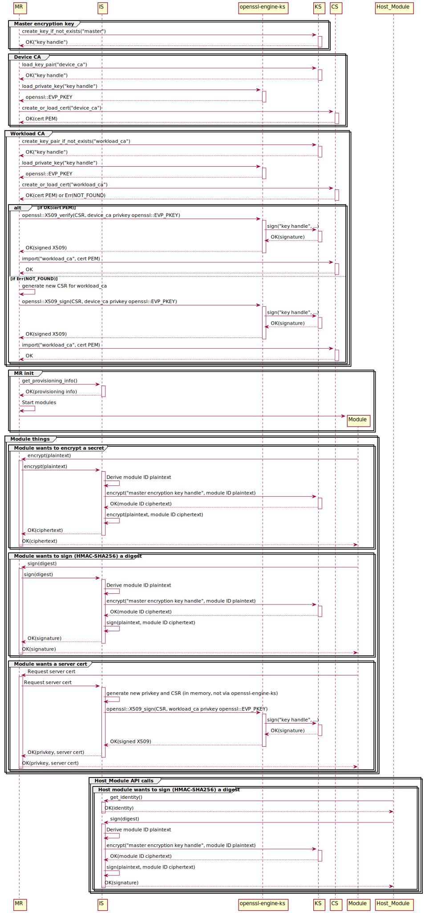

(This assumes device CA + workload CA are being used. For DPS-as-a-CA mode, ignore the device CA steps.)

1. User configures MR (`/etc/iotedge/config.yaml`).

    ```yaml
    certificates:
      # TODO: If we decide certs and keys *must* come from KS and CS, then the URI is redundant and it could directly be the respective IDs.
      # Otherwise using a URI allows the scheme to determine other options for the source, like file:// for files, which is required for backward compatibility
      # with existing config.yaml format.
      device_ca_cert: 'cert://device-ca'
      device_ca_pk: 'key://device-ca'
      trusted_ca_certs: 'cert://trusted-ca'

    agent:
      name: 'edgeAgent'
      type: 'docker'
      config: {...}

    hostname: '...'

    connect:
      management_uri: 'unix:///var/lib/iotedge/mgmt.sock'
      workload_uri: 'unix:///var/lib/iotedge/workload.sock'

    listen:
      management_uri: 'unix:///var/lib/iotedge/mgmt.sock'
      workload_uri: 'unix:///var/lib/iotedge/workload.sock'

    homedir: '/var/lib/iotedge/iotedged'

    moby_runtime:
      uri: 'unix:///var/run/docker.sock'
    ```

1. User configures CS to preload the device ID cert.

    ```toml
    [preloaded_certs]
    "device-id" = "/var/secrets/device-id.cer"
    ```

1. User starts MR.

1. MR does its work.

    
