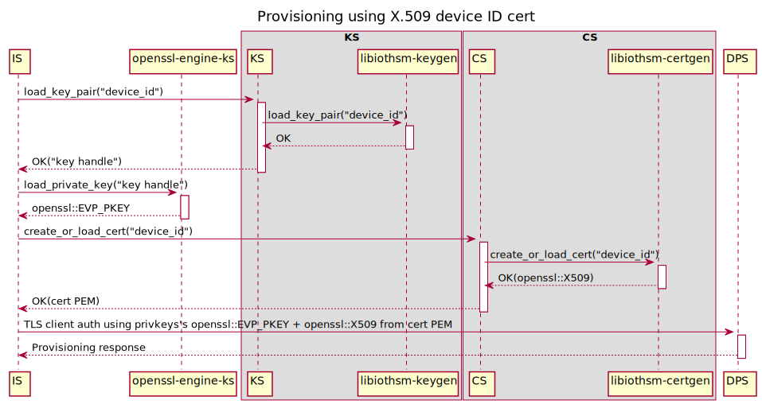
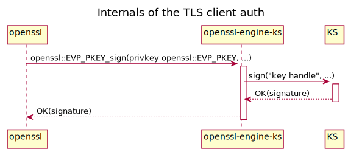

1. User preloads the device ID cert's privkey into their device's HSM and installs the PKCS#11 library to access it.

1. User configures KS to use PKCS#11 and preloads the device ID cert's privkey.

    ```toml
    [keystore.pkcs11]
    "lib_path" = "/usr/lib/softhsm.so"
    "base_slot" = "pkcs11:slot-id=0?pin-value=1234"

    [keystore.preloaded_key]
    "device-id" = "pkcs11:slot-id=0;object=device%20id?pin-value=1234"
    ```

1. User configures CS to preload the device ID cert.

    ```toml
    [certstore]
    "homedir_path" = "/var/lib/iotedge/cs"

    [certstore.preloaded_cert]
    "device-id" = "/var/secrets/device-id.cer"
    ```

1. User configures IS with provisioning info.

    ```toml
    # TODO: If we decide certs and keys *must* come from KS and CS, then the URI is redundant and it could directly be the respective IDs.
    # Otherwise using a URI allows the scheme to determine other options for the source, like file:// for files.
    [provisioning]
    "source" = "dps"
    "scope_id" = "<ADD DPS SCOPE ID HERE>"

    [provisioning.attestation]
    "method" = "x509"
    "identity_cert" = "cert://device-id"
    "identity_pk" = "key://device-id"
    ```

1. User starts KS, CS, IS.

1. IS performs provisioning.

    
    
